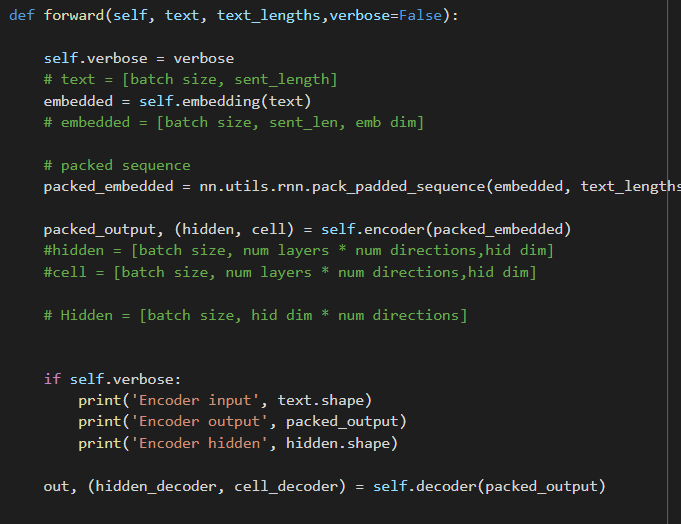

# END2_session6

# The aim of this assignment is to create a simple encoder , decoder and output the intermediate vector

1. Defined a class with encoder - LSTM, decoder - LSTM

2. Use a verbose flag to print the output of encoder module

3. Train the model with verbose = False

4. Once the model is trained, pass one 'tweet' and print intermediate tensor

5. Below is the intermediate tensor (output of encoder)

   
6. Below is the code to output the same

